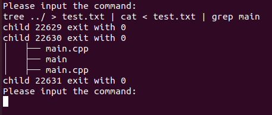

# Linux 系统编程练习

### 一、多进程复制文件
代码在 `cp` 目录下，已全部完成
1. 指定创建子进程的个数
2. 打开源文件
3. 打开目的文件, 不存在则创建
4. 获取文件大小
5. 根据文件大小拓展目标文件
6. 为源文件创建映射
7. 为目标文件创建映射
8. 求出每个子进程该拷贝的字节数
9. 创建N个子进程
10. 子进程完成分块拷贝(注意最后一个子进程拷贝起始位置)
11. 释放映射区

使用方法：
```shell
cd ./cp     # cd到cp目录下面

make        # 编译，得到可执行文件 main

./main [childprocessNum] [srcFilename]  # 运行可执行文件，得到 copy.txt 的复制文件
```


### 二、简易shell
代码在 `easy_shell`目录下，实现步骤： 
1. 接收用户输入命令字符串，拆分命令及参数存储。（已完成)
2. 实现普通命令加载功能 （已完成)
3. 实现输入、输出重定向的功能 （已完成)
4. 实现管道 （已完成)
5. 支持多重管道（已完成)

使用方法：

```shell
cd ./cp     # cd到cp目录下面

make        # 编译，得到可执行文件 main

./main      # 运行可执行文件

# 示例命令
tree ../ > test.txt | cat < test.txt | grep main    
```
结果如下所示：
